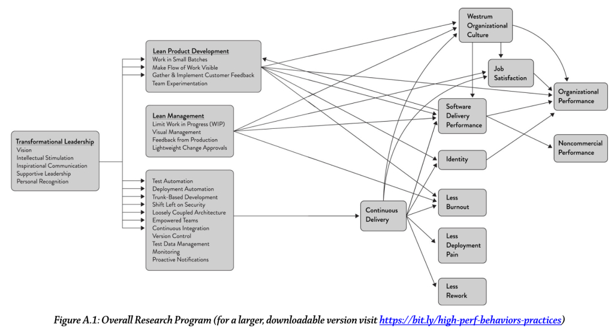

24 Capabilities for Continuous Delivery
=======================================

I recently read the book Accelerate by Nicole Forsgren, PhD, Jez Humble, and Gene Kim. The book is essentially
a research report on a multi-year study that used rigorous statistical methods to answer the question, "what drives
software delivery performance?" It presents a statistically-supported causal relationship between various organizational
and developmental practices and the agility with which teams deliver software. The authors even draw these relationships
visually:

I've heard time and again the importance of many of these practices, especially test automation, deployment automation,
monitoring, alerting, and making work visible. Some were newer to me, like the idea of transformational leadership and
Westrum organizational culture. For all of them, it's helpful to know that they lead to better outcomes for the
business.

I was a bit surprised to find that this book doesn't actually go into detail about how to implement these practices.
That's ok, we can figure that out with some research and experimentation.

This book provides a useful overview of how to improve the delivery performance of a software team, and I heartily
recommend it to everyone on the Parse.ly Product team. I think there might have been a book club suggested about it
months ago...I'm still interested!

Accelerate's Model and Parse.ly's Product Team
----------------------------------------------

I'm wanting to review this book by looking at Parse.ly's Product team through the lens of its 24 core capabilities. My
goal here is primarily to provide a new lens through which we can all look at how our team works. It's also my goal to
avoid judging the performance of individuals or teams, instead taking a holistic view of the entire Product team.
There's the caveat that as a member of the backend guild, my perspective cannot be unbiased.

I've given each capability a maturity rating indicating my opinion of how well-developed it is on our team. To be very
clear: this is just my opinion. No decisions are currently being made on the basis of this analysis, and I'm going out
of my way not to single out individuals or teams, or to be passive-aggressive. This framework is also just one of many
ways of looking at an organization. I'm not trying to be dogmatic about this particular approach. In the long term,
I want to help maximize the team's ability to ship, in part because I think it's fun, and I'd love your help!

1. USE VERSION CONTROL FOR ALL PRODUCTION ARTIFACTS

Version control is the use of a version control system, such as GitHub or Subversion, for all production artifacts,
including application code, application configurations, system configurations, and scripts for automating build and
configuration of the environment.

Maturity: pretty high

Application code at Parse.ly is in source control.

Application configuration at Parse.ly might include feature flags, whose definitions and associations with customer
accounts are handled outside of source control. Audience segments are arguably application configuration.

System configuration at Parse.ly includes things like Elasticsearch Cluster configs in CustDB, which aren't in source
control. We might also consider stage-specific settings files to be system config, which is in source control.

Most of Parse.ly's infrastructure build automation is handled by code in source control via Ansible and Terraform, but
small bits of it are still managed in an ad-hoc process.

2. AUTOMATE YOUR DEPLOYMENT PROCESS

Deployment automation is the degree to which deployments are fully automated and do not require manual intervention. 

Maturity: medium

From the perspective of a Parse.ly engineer not running this week's release, deployments are fairly automatic - merge to
master and it will get deployed in the next week. For the release manager, though, deployments follow a pretty involved
process that takes some extra time outside of working hours every week. Luckily the process involves running a bunch of
different scripts from source control and looking at dashboards, so the chance of human error is fairly low but still
present.

3. IMPLEMENT CONTINUOUS INTEGRATION

Continuous integration (CI) is the first step toward continuous delivery. This is a development practice where code is
regularly checked in, and each check-in triggers a set of quick tests to discover serious regressions, which developers
fix immediately. The CI process creates canonical builds and packages that are ultimately deployed and released. 

Maturity: pretty high

The backend guild's culture treats a broken master build as a big deal. It's been ages since the build stayed broken for
more than half a day. The tests that the build runs mostly exercise small code units rather than integrated application
environments. This means that there's an entire class of issue that doesn't cause the build to break. The CI process
creates versioned builds of internal library code, but it doesn't do the same for application code.

4. USE TRUNK-BASED DEVELOPMENT METHODS

Trunk-based development is characterized by fewer than three active branches in a code repository; branches and forks
having very short lifetimes (e.g., less than a day) before being merged into master; and application teams rarely or
never having “code lock” periods when no one can check in code or do pull requests due to merging conflicts, code
freezes, or stabilization phases.

Maturity: pretty high

The Parsely/engineering repo has 6 active branches maintained by humans in the last week at the time of this writing. We
don't measure aggregate stats about branch lifetime, but anecdotally I suspect that the median lifetime is more than one
day. Even so, we generally manage to avoid code freezes. Maybe this is accounted for by our use of a monorepo - the
number of active branches per project is always lower than the number for the whole repo.

5. IMPLEMENT TEST AUTOMATION

Test automation is a practice where software tests are run automatically (not manually) continuously throughout the
development process. Effective test suites are reliable—that is, tests find real failures and only pass releasable code.
Note that developers should be primarily responsible for creation and maintenance of automated test suites. 

Maturity: medium

Parsely/engineering unit tests are run in a completely automated fashion, and there's a regularly-used repeatable
process for smoke tests via the "beta baking" period of the weekly release. Our confidence that this approach generates
releasable code is very high, but it's more manual than it could be. Fully automated integration tests would improve the
situation.

6. SUPPORT TEST DATA MANAGEMENT

Test data requires careful maintenance, and test data management is becoming an increasingly important part of automated
testing. Effective practices include having adequate data to run your test suite, the ability to acquire necessary data
on demand, the ability to condition your test data in your pipeline, and the data not limiting the number of tests you
can run.

Maturity: pretty high

Parse.ly has a pretty good handle on fixture data for unit tests. Usually it's small enough to live in source control
and is maintained by scripts. For smoke testing in the pre-production environment, test data is limited by the set of
"beta apikeys" in source control, which is often not representative of the different characteristics of true production
data. There have been many occasions where the lack of a beta apikey with specific characteristics has blocked shipping.

7. SHIFT LEFT ON SECURITY

Integrating security into the design and testing phases of the software development process is key to driving IT
performance. This includes conducting security reviews of applications, including the infosec team in the design and
demo process for applications, using preapproved security libraries and packages, and testing security features as
a part of the automated testing suite. 

Maturity: medium

Parse.ly doesn't have much of a culture of integrated security in the development process. The most recent
security-focused efforts have been heavily siloed away from most of the Product team.

8. IMPLEMENT CONTINUOUS DELIVERY (CD)

CD is a development practice where software is in a deployable state throughout its lifecycle, and the team prioritizes
keeping the software in a deployable state over working on new features. Fast feedback on the quality and deployability
of the system is available to all team members, and when they get reports that the system isn’t deployable, fixes are
made quickly. Finally, the system can be deployed to production or end users at any time, on demand. 

Maturity: not very high

Parsely/engineering doesn't have strong continuous delivery guarantees. stable is kept deployable, but master is not.
Feedback on whether master happens to be deployable isn't available very fast. The culture discourages deployment of
low-latency systems during business hours, largely because of organizational scar tissue and lack of strong guarantees.

ARCHITECTURE CAPABILITIES
-------------------------

9. USE A LOOSELY COUPLED ARCHITECTURE

This affects the extent to which a team can test and deploy their applications on demand, without requiring
orchestration with other services. Having a loosely coupled architecture allows your teams to work independently,
without relying on other teams for support and services, which in turn enables them to work quickly and deliver value to
the organization.

Maturity: medium

Looking at the Parsely/engineering monorepo as a whole, most projects are loosely coupled from each other. For example,
it's possible to deploy the pixel servers with a solid understanding of how it could affect the indexing pipeline (that
is, very little). There are some core systems, though, that lump lots of multiple concerns into a single tightly-coupled
unit. The storm topologies are a good example of this: adding a new field to the tuple format in a topology can require
changes to the code of every component in that topology.

Broadening scope outside of the backend guild, the Parsely/mage library is the poster child for tight architectural
coupling resulting from organizational silos. Changes to this library have for years been the activity with the most
development overhead in complex projects, because it's tightly coupled to two projects (Dash and the API) owned by
different teams.

10. ARCHITECT FOR EMPOWERED TEAMS

Our research shows that teams that can choose which tools to use do better at continuous delivery and, in turn, drive
better software development and delivery performance. No one knows better than practitioners what they need to be
effective.

Maturity: very high

Python as a lingua franca continues to serve Parse.ly well. Other tool choices are left up to teams - for example, the
frontend team used NewRelic while the backend guild used Datadog APM. Beyond some basic common ground in Python, teams
aren't told what tools to use.

PRODUCT AND PROCESS CAPABILITIES
--------------------------------

11. GATHER AND IMPLEMENT CUSTOMER FEEDBACK

Our research has found that whether organizations actively and regularly seek customer feedback and incorporate this
feedback into the design of their products is important to software delivery performance.

Maturity: very high

Showing customers work-in-progress and gathering feedback on it is deeply embedded in Parse.ly's product engineering
culture. I can think of a bunch of recent projects that have explicitly built this practice into their development
cadence, including Smart Tags and Conversions.

12. MAKE THE FLOW OF WORK VISIBLE THROUGH THE VALUE STREAM

Teams should have a good understanding of and visibility into the flow of work from the business all the way through to
customers, including the status of products and features. Our research has found this has a positive impact on IT
performance. 

Maturity: pretty high

Parse.ly does a pretty good job of making the value stream visible. Certainly the core of it, where products are built
during iterations, is well-visualized and embedded into the culture. There's also opt-in visibility to needs and
feedback directly from customers, though it's not curated for the product team. There's no visualization of the movement
of work from the customer need stage to the iteration scope stage.

Another issue is the ubiquity of invisible reactive work. It's not unusual for iteration projects to miss their goals
because of an unexpected influx of reactive work.

13. WORK IN SMALL BATCHES

Teams should slice work into small pieces that can be completed in a week or less. The key is to have work decomposed
into small features that allow for rapid development, instead of developing complex features on branches and releasing
them infrequently.

Maturity: very high

The global iteration cadence constantly reinforces the practice and value of working in small batches. This was a major
area of improvement for the product team just a few years ago.

14. FOSTER AND ENABLE TEAM EXPERIMENTATION 

Team experimentation is the ability of developers to try out new ideas and create and update specifications during the
development process, without requiring approval from outside of the team, which allows them to innovate quickly and
create value.

Maturity: pretty high

We generally maintain enough slack that engineers have some free time to experiment. The engineering culture is
permissive, though maybe not encouraging, of experimentation and stepping outside of predefined patterns and roles.

LEAN MANAGEMENT AND MONITORING CAPABILITIES
-------------------------------------------

15. HAVE A LIGHTWEIGHT CHANGE APPROVAL PROCESS

Our research shows that a lightweight change approval process based on peer review (pair programming or intrateam code
review) produces superior IT performance than using external change approval boards (CABs). 

Maturity: very high

The product team culture understands that code review isn't a replacement for testing, and as such doesn't use it as
a barrier to change approval.

16. MONITOR ACROSS APPLICATION AND INFRASTRUCTURE TO INFORM BUSINESS DECISIONS

Use data from application and infrastructure monitoring tools to take action and make business decisions. This goes
beyond paging people when things go wrong.

Maturity: pretty high

Parse.ly's application and infrastructure monitoring and alerting practice is fairly mature, and that information does
feed into business decision-making. Specific examples include the decision to focus on metadata extraction latency and
the use of customer-centric SLOs to control when code is released. Increased SLO coverage, especially on aspects like
data integrity, would help improve this practice.

17. CHECK SYSTEM HEALTH PROACTIVELY

Monitor system health, using threshold and rate-of-change warnings, to enable teams to preemptively detect and mitigate
problems.

Maturity: pretty high

Our alerting tells us when action needs to be taken. It's pretty rare though not unheard-of for customers to notice
system issues before the product team does. The biggest blindspot is, as above, data integrity issues, colloquially
known as "data discrepancies". We also do not use any rate-of-change warnings, which would be especially helpful in the
context of alerting on error budget burn rate.

18. IMPROVE PROCESSES AND MANAGE WORK WITH WORK-IN-PROCESS (WIP) LIMITS

The use of work-in-process limits to manage the flow of work is well known in the Lean community. When used effectively,
this drives process improvement, increases throughput, and makes constraints visible in the system.

Maturity: pretty high

We make a solid effort to limit the amount of proactive work that any given team member is assigned in an iteration,
roughly based on our understanding of their availability and other commitments. The confounding factor is reactive work.
When bugday tickets extend beyond a single day per week, they generate drag on planned work in a way that's invisible to
the iteration process.

19. VISUALIZE WORK TO MONITOR QUALITY AND COMMUNICATE THROUGHOUT THE TEAM

Visual displays, such as dashboards or internal websites, used to monitor quality and work in process have been shown to
contribute to software delivery performance. 

Maturity: medium

We don't do much to visualize WIP aside from maintaining a kanban board for the product team. There's room for
improvement here.

CULTURAL CAPABILITIES
---------------------

20. SUPPORT A GENERATIVE CULTURE

This measure of organizational culture is based on a typology developed by Ron Westrum, a sociologist who studied
safety-critical complex systems in the domains of aviation and healthcare. Our research has found that this measure of
culture is predictive of IT performance, organizational performance, and decreasing burnout. Hallmarks of this measure
include good information flow, high cooperation and trust, bridging between teams, and conscious inquiry.

Maturity: medium

We understand the value of breaking silos and strengthening information flow across teams, and there are some recent
examples of teams coming together to collapse sets of conflicting incentives. I think there's a lot of room for
improvement here because though we understand the value of doing this, we haven't applied it completely in most areas.
The cultural divide between frontend and backend is a prime example. Though it's weakening lately thanks in part to the
pods approach, my opinion is that there's more work to be done.

21. ENCOURAGE AND SUPPORT LEARNING

Is learning, in your culture, considered essential for continued progress? Is learning thought of as a cost or an
investment? This is a measure of an organization’s learning culture.

Maturity: very high

Learning is encouraged and supported on the product team. I can't think of a single time I've ever seen anyone on the
Parse.ly product team actively discourage someone from learning something new. The incentives to avoid making the effort
to learn new skills, especially the preponderance of knowledge silos, have also weakened in recent months.

22. SUPPORT AND FACILITATE COLLABORATION AMONG TEAMS

This reflects how well teams, which have traditionally been siloed, interact in development, operations, and information
security. 

Maturity: pretty high

The practice of treating pods as "first teams" and functional teams like backend as "guilds" is a strong structural
support of cross-team collaboration. There's probably more we can do to improve this, but my instinct is that we are
firmly on the right track.

23. PROVIDE RESOURCES AND TOOLS THAT MAKE WORK MEANINGFUL.

This particular measure of job satisfaction is about doing work that is challenging and meaningful, and being empowered
to exercise your skills and judgment. It is also about being given the tools and resources needed to do your job well. 

Maturity: pretty high

We aggressively eliminate toil by asking engineers to automate it away. We consider each engineer's skills, interests,
and goals when scoping work, and each engineer has a say in their own commitments. Even with all of this positive
culture in place, demotivating and toilsome work still has a real cost. On the backend guild, this usually manifests as
customer support tickets.

24. SUPPORT OR EMBODY TRANSFORMATIONAL LEADERSHIP

Transformational leadership supports and amplifies the technical and process work that is so essential in DevOps. It is
comprised of five factors: vision, intellectual stimulation, inspirational communication, supportive leadership, and
personal recognition. 

Maturity: very high

I certainly feel all five of these factors when working with the Product leadership team.

The Platform Pod
================

I see the development of these capabilities for the Product team as key to the Platform pod's vision. The Platform pod
can do a lot to influence the team's maturity in these capabilities, especially items 1-10. The capabilities don't
dictate specific tools or approaches, and a big part of the pod's strategy will hinge on figuring out what tools and
processes to use to boost the Product team's shipping capabilities.

The pod's current projects are aligned with these capabilities. Migrating the pixel cluster to Ansiform increases the
maturity of our use of source control for infrastructure, and proving out GitLab CI improves our continuous integration
practice and sets up future continuous delivery possibilities.

There's more to come on this front. Maybe these thoughts will evolve into a vision or a strategy for the Platform Pod.

