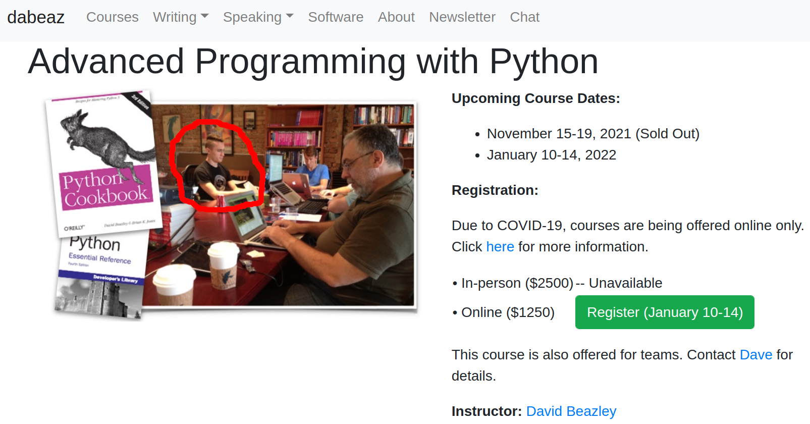
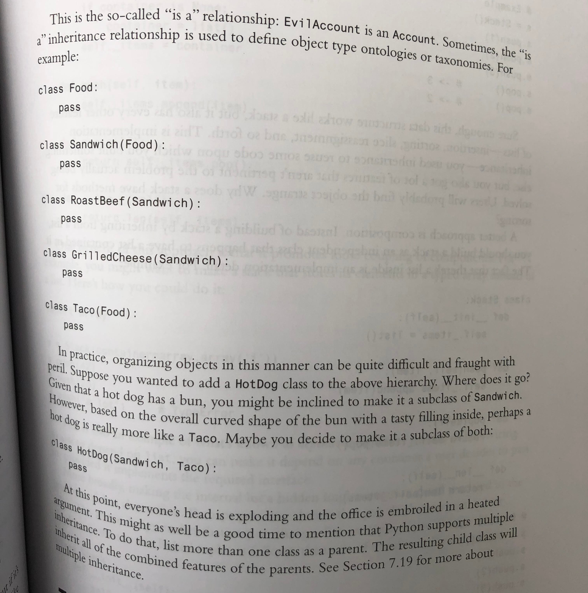

Python Distilled
================

I recently read David Beazley's new book Python Distilled, and I'd like to share a few thoughts about it.

I've been a huge dabeaz fan since I saw him speak at a PyCon years ago. He's got a great dry sense of humor and
approaches Python with a playfulness that I find comforting. He's also a magical wizard who knows the language inside
and out and is good at teaching it.

I had the privilege of experiencing his teaching in person when I attended the 2014 edition of his Write a Compiler in
Python course in Chicago.

Me and my 2014 haircut at Dabeaz's "write a compiler in python" course

The coursework felt like a huge stretch for me at the time, and probably still would. We wrote a compiler for a subset
of the Go programming language using only bare Python and a lexing library in five days, and it absolutely blew my mind.
It gave me one of my earliest experiences feeling like I really knew what I was doing as a programmer and was capable of
building big, complex things. The point is, dabeaz is a great teacher. So, how's his new book?

Python Distilled is structured as a narrative rather than a reference, a feature that I appreciated. It made the
material useful for a broad range of experience levels with Python - I can easily see it being someone's first
introduction to the language. Starting with the absolute basics of syntax and interactive experimentation, dabeaz uses
simple building blocks to show the reader what Python is uniquely good at while avoiding delving too deeply into
esoteric details.

So-called "dunder" or "magic" methods used in various language protocols (__iter__, for example) appear much earlier
than I would have expected. I've always thought of them as a fairly deep and esoteric feature of the language, but
dabeaz's foregrounding of these concepts shows Python's incredible extensibility and capacity for expressive
programming.

The chapter on generators bears a heavy similarity to the author's presentation "Generator Tricks for Systems
Programmers" that I learned from a few years ago. Putting it in the context of a broader narrative exploring all of the
language's core features makes it clear how and when certain generator capabilities are useful. Throughout this and
other sections, dabeaz provides a grounded, hype-free perspective that repeatedly advocates simplicity and readability.
The impression this leaves me with is that Python is a friendly, approachable language that doesn't put a high barrier
in front of new users.

As someone who cut their teeth on Python 2, my experience of this book was primarily one of looking out for changes with
Python 3.8+ that I wasn't aware of or lacked context on. There were quite a few, but maybe fewer than I expected given
how uninterested I am in keeping up with the latest hackernews posts. Some highlights of new pieces of knowledge that
I took from this read:

* The := "walrus" operator
* exception.__context__
* Positional-only arguments
* Deeper understanding of "enhanced generators" and their relation to async
* A class can contain arbitrary Python code, not just function and variable definitions
* "Really private" mangled attributes starting with __
* Pitfalls of multiple inheritance
* Manually walking an object's __mro__
* What's really going on with StringIO

Finally, I would be remiss if I didn't include this example of dabeaz's wonderful sense of humor from the book.

A fun example of dabeaz's dry sense of humor

Python Distilled gets a strong recommendation from me for anyone who uses Python! It's approachable, humorous,
straightforward, and packed with information. Read it and tell me about something cool that you learned!
