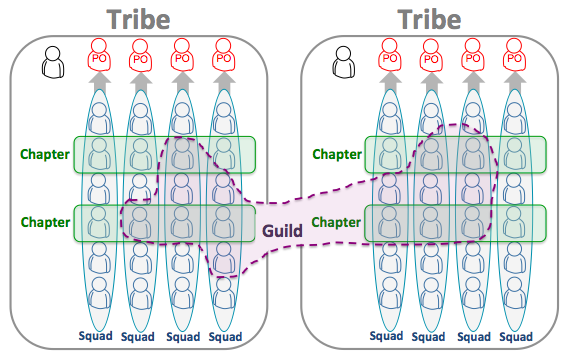

Team Topologies
===============

I recently read the book *Team Topologies* by Matthew Skelton and Manuel Pais, and I'd like to share a few thoughts
about it.

This book evolved from the hugely popular ideas on [DevOps topologies](https://web.devopstopologies.com/), attempting
a generalized theory of how technology teams communicate effectively between one another. It heavily cites testimonials
from practitioners as well as the research from *Accelerate*.

The argument begins with Conway's Law, that a system architecture is isomorphic to the communication structure of the
group of people who built it, and examines some of its often-overlooked implications. Among these are the realization
that some lines of communication must be strengthened and others cut off entirely - collaboration, like hierarchy, must
be justified. There's also examination of the approach by which communication patterns are designed with the intent of
creating a given architecture (sometimes called the "reverse Conway maneuver", which is a bit too cute for me).

*Team Topologies* puts forth a taxonomy of team types and communication modes, and expands on their various uses,
interactions, strengths, and weaknesses.

Types of Teams
--------------

* Stream-aligned: cross-functional, empowered to own an entire value stream
* Enabling: works with another team to help them gain a missing competency
* Platform: provides a clean abstraction over functionality that multiple teams may use
* Complicated-subsystem: specialists owning a particularly complicated piece of code

Modes of Interaction
--------------------

* Collaboration: two teams working closely, blurring team boundaries, moving quickly, and handling uncertainty
* X-as-a-service: one team providing functionality to another via a well-defined, versioned, and product-managed API
* Facilitating: an enabling team unblocks a stream-align team and discovers hidden bottlenecks in delivery

The core innovation of *Team Topologies* as I see it is the distinction between collaboration and as-a-service
communication. Teams are expected to move from collaboration to as-a-service over time as their shared problem space
becomes more well-defined and products mature. The key distinction is between groups that make clear promises to each
other and those that don't (yet). The classic example is platform versioning: the platform maintainers implicitly
promise not to break code that depends on their software.

Borrowing a concept from sculpture, *Team Topologies* recommends defining teams around existing "fracture planes" in the
organization, creating "bounded contexts" in whicn each team exercises full ownership of a particular value stream.
Examples offered of fracture planes include business domain, change cadence, risk profile, and user persona. Which of
these factors actually constitute viable fracture planes varies between organizations.

There's much to be gained from comparing the communication modes at one's own organization to the archetypes presented
in the book. For example, one could consider Parse.ly's current Platform Pod to be a platform team or an enabling team,
or even a "community of practice". A testimonial gave me another chance to compare Parse.ly's approach, describing the
"Spotify model" of team interaction.

The core similarity between Parse.ly's approach and Spotify's is the two-dimensional framing of a group, aligning to
product and technical affinity. What Spotify calls "squads", Parse.ly calls "pods" - cross-functional stream-aligned
teams containing a Product Manager. What Spotify calls "chapters", Parse.ly calls "guilds" - groups with shared
technical specializations. Some members from each chapter self-organize into long-lived squads.

This points to one of the book's central messages: a topology depicting a communication relationship between teams is
a point-in-time snapshot that is expected to change over time. One surefire way to misapply the lessons from this book
is to pick a single team topology and never deviate from it. Instead, the authors advocate building a "sensing
organization" that takes in and acts on signals from the outside world.

*Team Topologies* seems to be written for executives. There are summaries at the beginning of every chapter, and
a pervasive focus on "strong leadership". The book allows the reader to presume top-down decisionmaking. I'd have
preferred a clearer acknowledgment that engineers are capable of figuring out team organization without having it
mandated from above, but I also understand that building such a grassroots decision-making muscle in an organization is
a huge undertaking.

I dislike the focus on top-down decisionmaking, but I'm still on board with the *Team Topologies* approach overall. It
has a humanistic bent, with a team-first approach that reduces cognitive load, sizes systems to teams, limits
free-for-all communication, and minimizes distractions. To me, a team-first approach says "honor your teammates'
intelligence, focus, and creativity, and the rest will follow".
