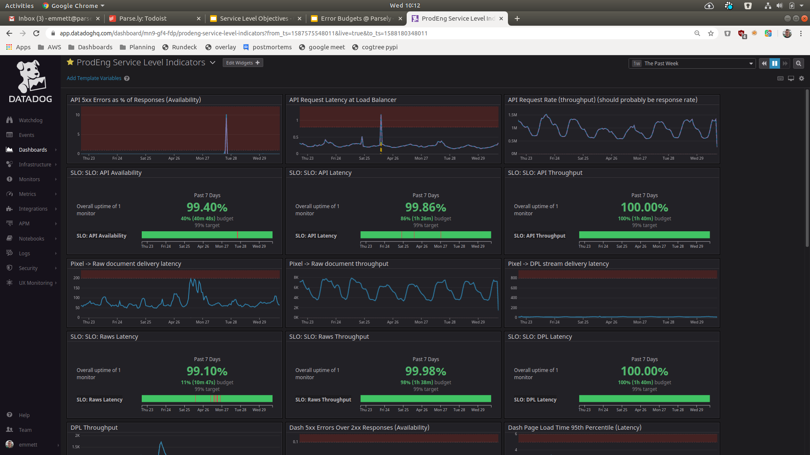
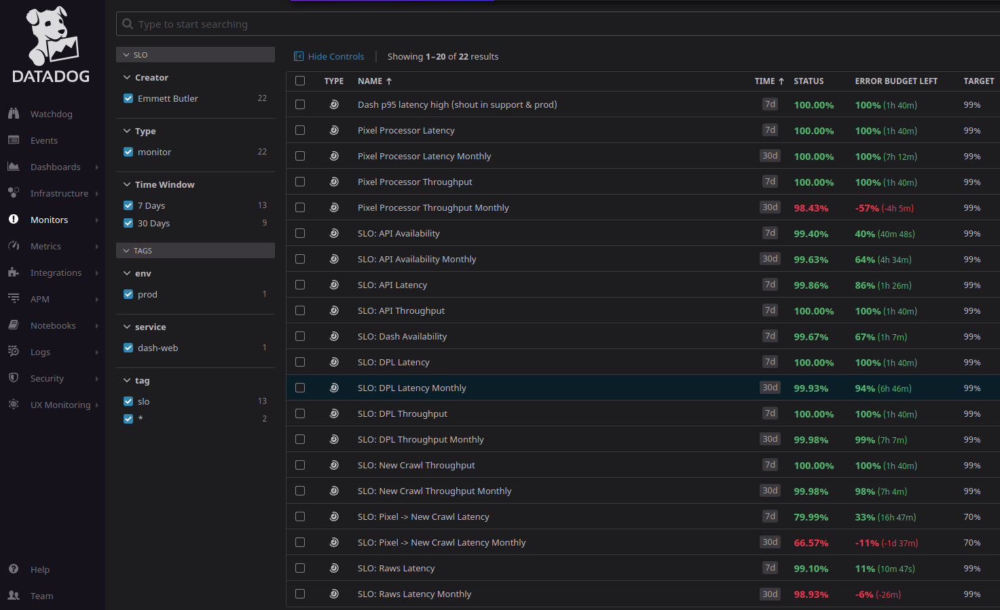
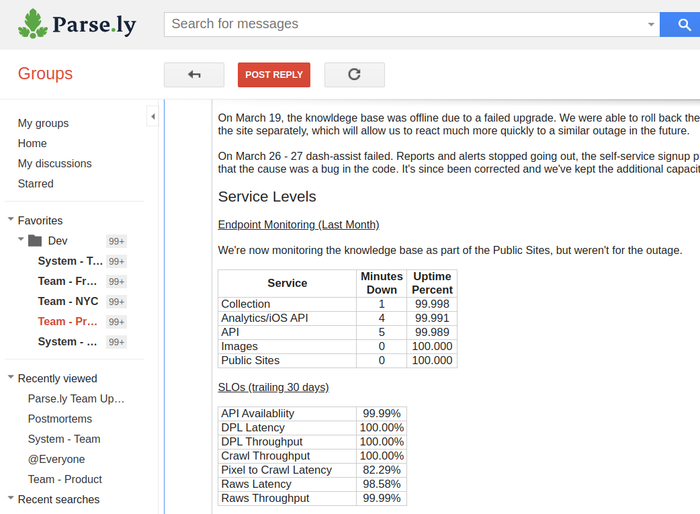
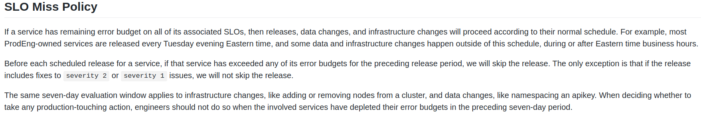
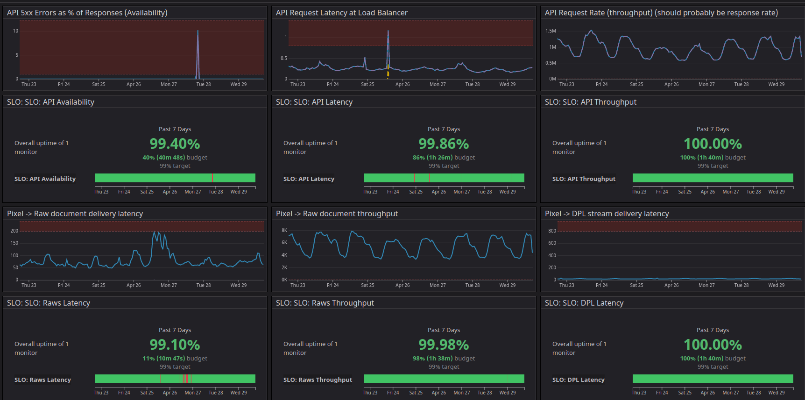

# Error Budgets @ Parse.ly

# Emmett

# 

# Lexicon

__Service Level__ : How well the software service fulfills a particular customer expectation

__Service Level Indicator / SLI__ : A quantitative measure of the service level

__Service Level Objective / SLO__ : A target value or range for an SLI

__Error Budget__ : How much an SLO can be missed per unit time

__Service Level Agreement__ : Contract terms about a service level

# Error Budgets

Not a punishment for breaking production

Not a punishment for anything

Aligns incentives between teams and pods

Allows multiple teams to reach the same conclusion about production risk

Removes politics and rancor from the innovation/stability debate

# 

These are  __just__  SLIs

\(Service Level Indicators\)

How do we give these SLIs “teeth”?

Use them to build an error budget policy\!

_[https://github\.com/Parsely/web/blob/master/slo/slo\_document\.md](https://github.com/Parsely/web/blob/master/slo/slo_document.md)_

_[https://github\.com/Parsely/web/blob/master/slo/error\_budget\_document\.md](https://github.com/Parsely/web/blob/master/slo/error_budget_document.md)_

