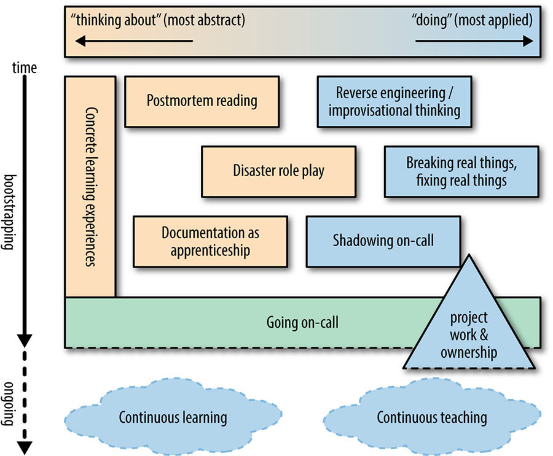

On-Call Onboarding
==================

In order to maintain a service consistently and globally, you need to trust that your fellow on-callers know how your
system works, can diagnose atypical system behaviors, are comfortable with reaching out for help, and can react under
pressure to save the day. ~Site Reliability Engineering

This document describes one possible path an engineer can take from new hire to member of the on-call rotation. It’s
loosely based on the framework from the SRE book.

Phase 1: On-Call Student
------------------------

Learning Checklists
-------------------

These checklists provide sequential, cumulative learning paths that engineers can follow to gain familiarity with the
systems for which they’ll be responsible. Familiarizing oneself with the information outlined in the relevant
checklist is a great first step in the on-call journey.

Here are some key resources that an engineer can use to progress through these checklists, roughly ordered by level of
abstraction

* Postmortems
* System documentation in source control
* The code itself

Postmortem Reading
------------------

Reading historical postmortems is a great way to build knowledge of both system architecture and incident response
methodology. It’s also crucial to develop the skill of learning from system failure, of which postmortems are the
primary artifact. As an engineer goes through their on-call journey, it’s recommended to use postmortems as a resource
for working through learning checklists.

Documentation as Apprenticeship
-------------------------------

While working through the learning checklist, an engineer will encounter problems with the documentation at all levels.
While it is not the job of an engineer on an on-call journey to fix every bit of inaccurate or outdated
documentation they find, identifying and performing documentation improvements during this process is a powerful way
to reinforce learning while building a discoverable body of knowledge useful to the next on-call trainee.

Key documentation areas that engineers on an on-call journey should focus on improving include

* Playbooks, especially those missing common incident scenarios from recent postmortems
* Pages that are missing entirely from the documentation, including playbooks for newly-released systems
* README files in source control

Phase 2: Shadowing On-Call
--------------------------

Once an engineer has completed the relevant On-Call Learning Checklists, they are ready to start shadowing the on-call
engineer. The goal of shadowing is to gain as much real-world on-call experience as possible in a risk-free way, as
well as to build confidence among the team that the new engineer is ready for on-call responsibility.

To shadow the on-call engineer is to receive the same alerts that the primary on-call does, to closely observe their
approach to incident response, and to solicit knowledge sharing from the primary after incidents. The main recommended
way to facilitate this knowledge sharing is to coauthor postmortems with the primary. The shadowing phase is also a
good time for a new engineer to familiarize themselves with the On-Call methodology document.

While shadowing, the new engineer should ensure that they’ve fulfilled all technical prerequisites listed under “Setup
Steps” in the Learning Checklist. An on-call shadowing alerting arrangement can be set up by manually editing the
PagerDuty Escalation Policy to send alerts to both Primary and the shadower. This needs to be manually undone after
the shift.

After 1-3 shadow on-call shifts, an engineer is likely ready to serve as the secondary on-call for shifts during which
the primary is sufficiently experienced. After a few such secondary shifts, the engineer is ready for their first
primary shift.

Phase 3: The First Primary On-Call Shift
----------------------------------------

The most important aspect of an engineer’s first primary on-call shift is that an experienced engineer serves as the
secondary. This gives the new engineer and the rest of the team confidence that critical incidents can be addressed
effectively while still giving the new engineer the highest level of responsibility.