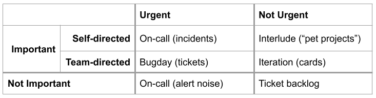

Prioritizing Reactive Work
==========================

How we spend our time on the team can be divided into proactive and reactive work. Proactive work starts with an idea,
like “we want to solve this particular product question”. It’s planned for and prioritized in advance using various
tools like iterations, interludes, and the tech-debt ticket backlog. Thus it comprises “the plan” insofar as one
exists. Reactive work, on the other hand, is the work we can’t plan for. It interrupts our plans and asks for a
response on some relatively short timeline.

The distinction between proactive and reactive that we use fits nicely into an Eisenhower Matrix.

This matrix and this whole document describe the present state of how we decide what to work on as individuals and
teams. One can imagine improvements to these norms, and we can all work to make them better serve our needs.

Bug Day
-------

Our team calls Wednesdays “bug days”. When we say this, we mean that we hold each other accountable for handling the
various urgent-and-important engieering tasks that arise. We also mean that there’s no cultural pressure to complete
non-urgent work on bug days, providing space for full focus on issues being handled reactively.

We manage these tasks with GitHub Issues, with each issue denoting a customer pain point. We discuss the issue in
comments and link to pull requests that fix or reduce the customer pain.

The allocation of 20% of work time for urgent-and-important tasks is an acknowledgment that the company needs to be
responsive to customers’ needs and questions in order to be successful as a business. Customers pay us a lot, and they
reasonably become dissatisfied when their expectations aren’t being met. The practice also acknowledges that many
issues in our complex system are hard to estimate for size, and may require attention on an ongoing basis.

An Interface Between Teams
--------------------------

Reactive tickets come to the team by way of the Support team, who filter the many customer questions into an
actionable list of tickets for engineers. Because these two teams have separate work cadences, mandates, and
membership, this list of tickets carries much of the weight of communication between the groups. This means that the
tickets are ripe for misunderstanding, confusion, frustration, anger, and other strong emotions.

It’s critical to remember that there is a human on the other side of every ticket comment, and to assume positive
intent on their part. Our company and the industry at large incentivize engineers to focus on planned work and build
new things. These same forces incentivize Support professionals to minimize customer pain and keep them paying for the
product. We try our best to keep these conflicting incentives in mind as we navigate the team interface.

Customer Expectations
---------------------

Customers contact our Support team when they think something is wrong with the product. Put another way, the product’s
behavior (showing particular numbers, responding to HTTP requests, etc) doesn’t match what the customer expects –
“expectation mismatch”. This dynamic has far more influence over what questions we hear from customers than our code
itself does. There are even many aspects of our complex product that we consider “broken” or “buggy” (ie we expect
different behavior) that customers consider “working” (they expect the actual behavior).

Expectation mismatch and the product’s complexity blur the distinction between “bug” and “missing feature”.

The most basic shared assumption that our team has with customers might be phrased as:

"A request for information from the product will return quickly and without error, and the returned information will
be consistent with other sources of the same information that the company provides."

We codify this shared assumption to the best of our ability by using the concept of “service levels“.

Issue Categories – What’s the Source of the Mismatch?
-----------------------------------------------------

As engineers, when we see a Support professional open a reactive ticket, our first priority is to figure out what’s
beneath the expectation mismatch. There are a few possibilities:

* a production incident in disguise, in which case it demands the attention of the on-call engineer
* an open-ended investigation (complex, important, urgent), in which case it might deserve to be promoted to an
    iteration project
* a straightforward bug (simple, important, moderately urgent), in which case it can be worked on in upcoming bug days
* a pain-in-the-neck issue (complex, not important) that doesn’t affect a lot of people and isn’t worth digging into

This is often a difficult distinction to make, because doing so requires a holistic understanding of both the complex
technical system and the complex business context of the issue report. To illustrate: an open-ended investigation of a
discrepancy reported by a low-value customer account but affecting many has a different urgency/importance profile than
a simple bug reported by and only affecting a single high-value account.

We ask these questions on each ticket to help us discover which category the ticket belongs to.

* How long has this behavior been happening? What’s the earliest known report of this behavior?
* Which customer accounts are definitely displaying the behavior? Which do we think might be?
* Does the timing of the behavior concur with the timing of any production events, like deployments or incidents?

Making a Call
-------------

Before it’s acted upon, every reactive ticket requires an engineer to make a call about what category it’s in. This is
often difficult – it requires taking a strong position across a team boundary that sometimes conflicts with another
team’s mandate. For example, deciding that a ticket is not worth fixing might be a prudent business decision, but it
will likely disappoint the specific customer who reported it, exacerbating incentive conflict between Product and
Support. When this seems likely, we often call in Product team leaders to bridge the communication gap and help both
teams make sure their needs are met.

It’s also sometimes the case that a ticket doesn’t contain enough information to make an educated decision about its
category, and doing so requires a big time investment in itself. When this happens, we often communicate this to the
Support professional who opened the ticket, ask for more information, and wait for a week or two to see if it’s
forthcoming. If it’s not after a few weeks, we often close the ticket and leave a thoughtful explanatory comment.

Bug Day Accountability
----------------------

Once we know what category a ticket is in, we can address the underlying issue. We use GitHub issues’ “assigned”
feature to indicate current ownership of a ticket. On the Product team, we hold each other accountable as ticket
owners for the following behaviors:

* Commenting on the ticket at least weekly to indicate the current state of the response, including changes, blockers,
    and unknowns
* Asking clarifying questions on the ticket to build certainty about what category it’s in
* Remembering that all tickets are filed by well-intentioned humans, and communicating with them accordingly
* Investigating and articulating the root cause of the issue
* Learning about the codebase containing the bug
* Implementing a code or documentation change that resolves the expectation mismatch using a pull request
* When we are unable or unavailable to do any of these, proactively communicating that to Support and Product team
    members, and proactively transferring ownership to another engineer
* Reserving weekly Bug Day time for these tasks
* Celebrating the complex, difficult, and interesting tickets that teammates have closed