# Reliability: Failure is Inevitable

# Emmett Butler
Director of Engineering

# I will call on you

# Reliability

how well your product upholds its promises to users

"the site will load”

"the site will load  __fast__ "

“the site will show the right data”

etc\.

# Promises

# Reliability is a Product Differentiator

If your product isn't available\, it doesn't matter how many cool features it has\.

All of the resources invested in building trust with a customer get wasted\.

Without trust\, there is no “us”\.

When was the last time google\.com failed to load for you?

# How reliable is your product?

What are some of the promises it makes to its users?

# System failure is inevitable

# Is google.com 100% reliable?

# google.com

Not 100%\, but 99\.999%

Equivalent to  __6 seconds per week__  of downtime

# Let’s Pretend

We work at a company that gets paid by other companies to host their blogs

__Product__ : the blog

__Users__ : blog readers

__Customers__ : blog owners

__Service__ : program serving requests to the blog from readers

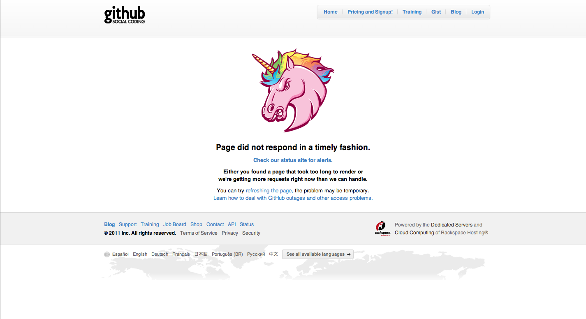

# Aggregate Availability

# Measuring

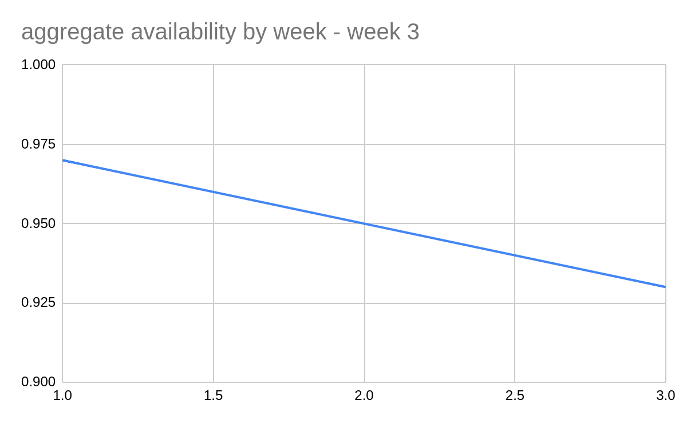

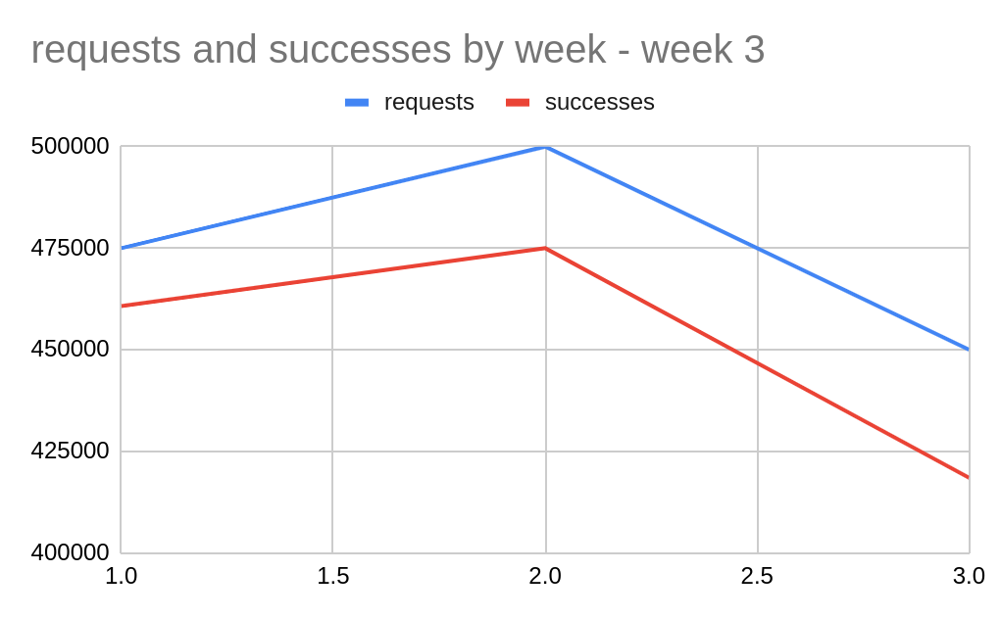

Average weekly success rate = \(95 \+ 93 \+ 97\) / 3 = 95%

Downward trend

# Evaluating

Is 95% availability as high as our users expect?

Is it as high as our competitors’ availability?

Let’s make it higher

# Setting a Goal

Let’s make our service 99% reliable in the average week

How?

# The Following Week

Measured 435k requests\, 428\.5k successes \(98\.5%\)

Nice improvement\!

What can we do to reach our goal of 99%?

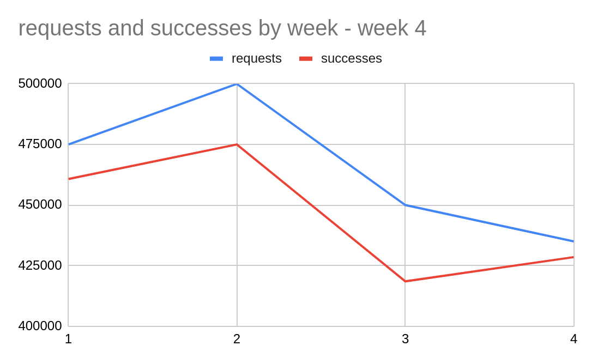

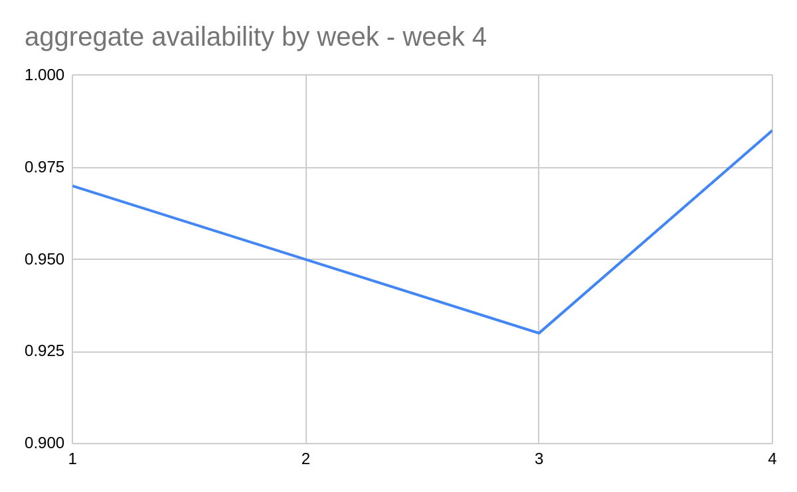

# Two Weeks Later

Brent is investigating but hasn't come up with anything concrete\.

Others have put aside their scheduled work to chase the goal\.

Leadership is starting to get antsy

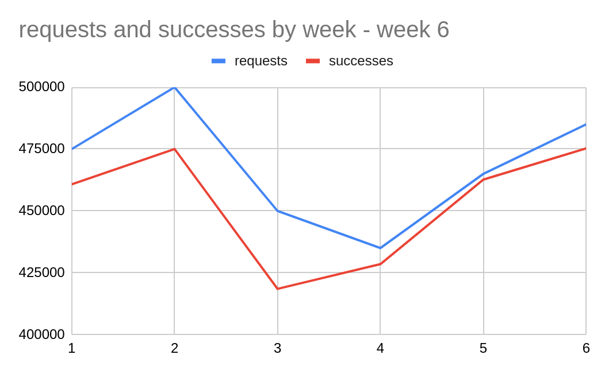

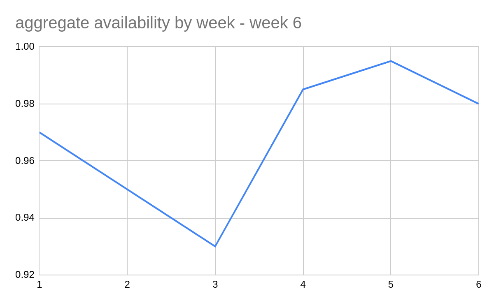

# What do we do now?

# A Possible Solution

Every monday\, look at the previous week's availability and use it to decide what to work on that week

If availability was above our goal of 99%\, we'll work on new features\.

If it wasn't\, we'll work on reliability\.

# A Week Later

Availability for last week exceeded 99%\.

Well\, I guess things are ok for now\. Let's work on that new feature\.

Availability is 94% after a big outage\.

Time to focus on follow\-up from that incident\.

We'll get back to new features next week\.

# Balance

Leadership doesn't need to bug the team about new feature work\, because they know it will happen when the availability target is met\.

Engineer\-operators don't need to worry about taking time for reliability\, because they have permission to do it when the availability target isn't met\.

# What problems do you foresee when we apply this approach in the real world?

# Reflect

Creates a “budget” of availability misses that engineer\-operators can spend or save at their discretion

A goal of 99% availability leaves a 1% budget of failures

A single measurable goal that encapsulates the need for investment in

__both reliability and innovation__

# Error Budget

# Most production incidents are caused by code changes

# “Innovation Budget”

Every code change has the potential to cause errors

Spend your budget on new features

Save it up with reliability work

# Standard Terms

__Service Level__ : how often requests succeed

__Service Level Indicator__ : the ratio of successful requests to total requests

__Service Level Objective__ : the desired value for that ratio

# How do you figure out what work will improve reliability?

# When production breaks, how does your team respond?

# Last Week’s Incident

A bug got into production

Lots of support tickets and angry customers

Communication was confusing

Multiple slack channels\, P2 threads

Two engineers pushed incompatible fixes at the same time

Weekly service level was 92%

# When failure is inevitable, we need to learn from it

# Two obstacles to learning from failure: chaos and making the same mistake twice

# Chaos

# Signs of Chaos

Poor communication

No clear source of truth

Diffuse responsibility / “freelancing”

Many stakeholders directly involved

Sharp focus on the technical problem

# How to Reduce Chaos

Single source of truth about incident state

Incident management framework

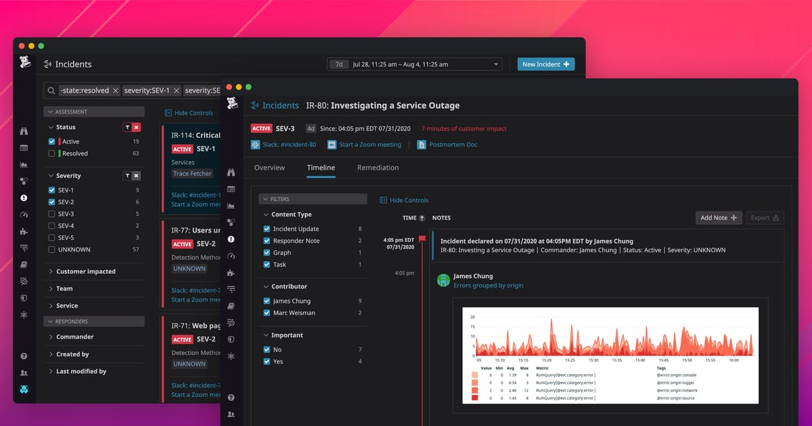

Incident State

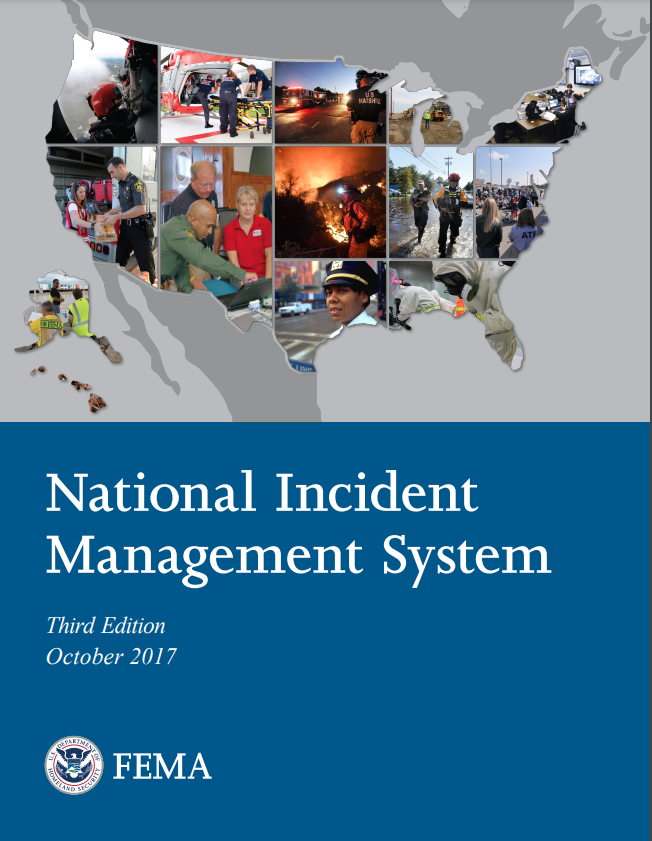

# Making the Same Mistake Twice

# Postmortems

Write down what you learned from an incident so you remember it as a team

Fix sources of rote\, repetitive work

# Postmortem Culture

Blame systems\, not people

Postmortem of the Month

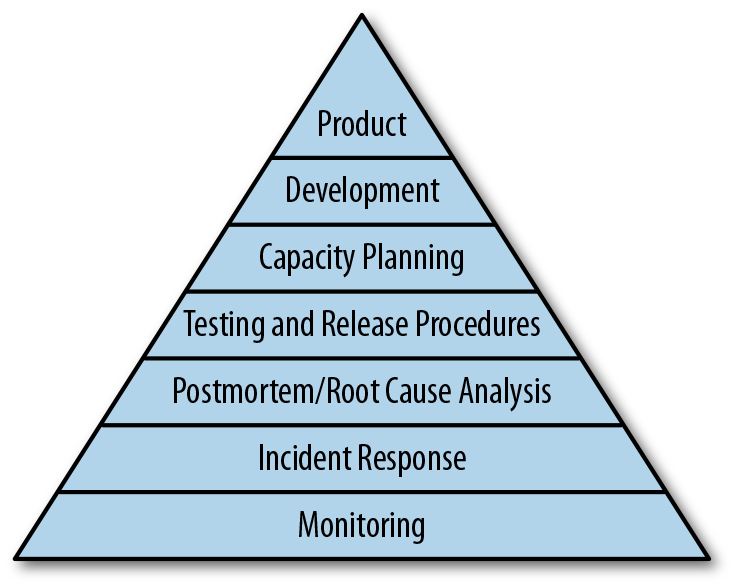

Moving up the hierarchy of reliability

# Thank you

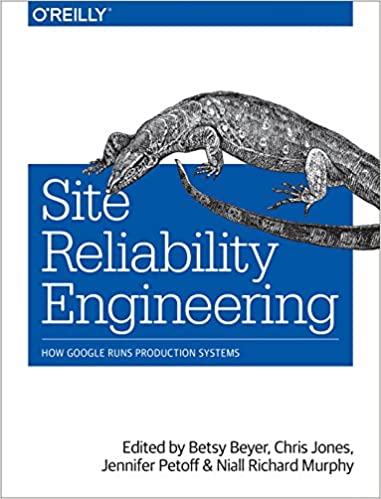

https://sre\.google/books/

