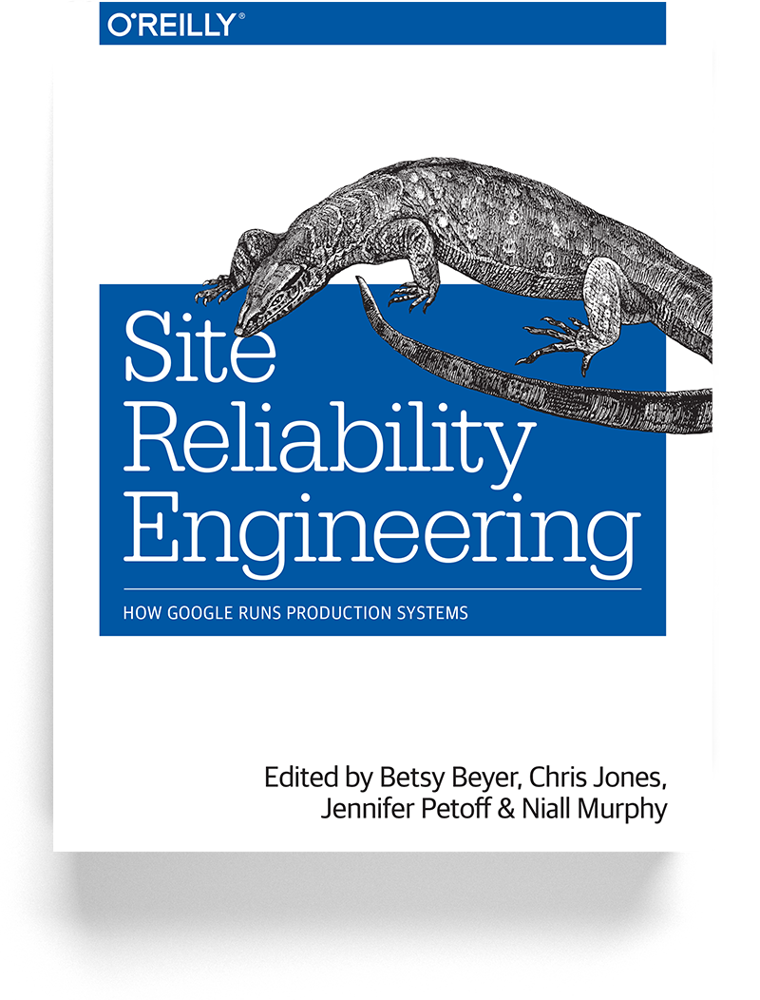
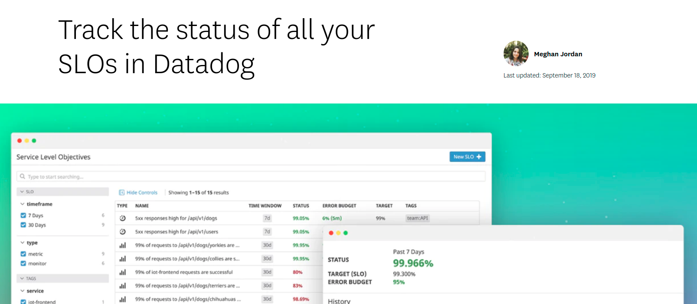
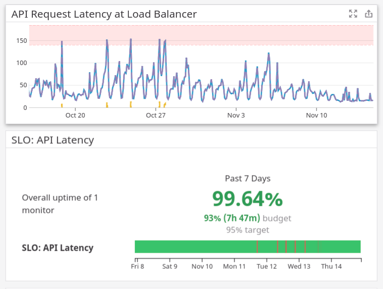
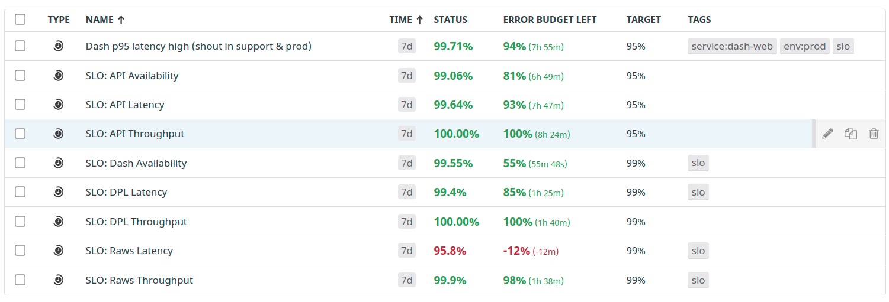
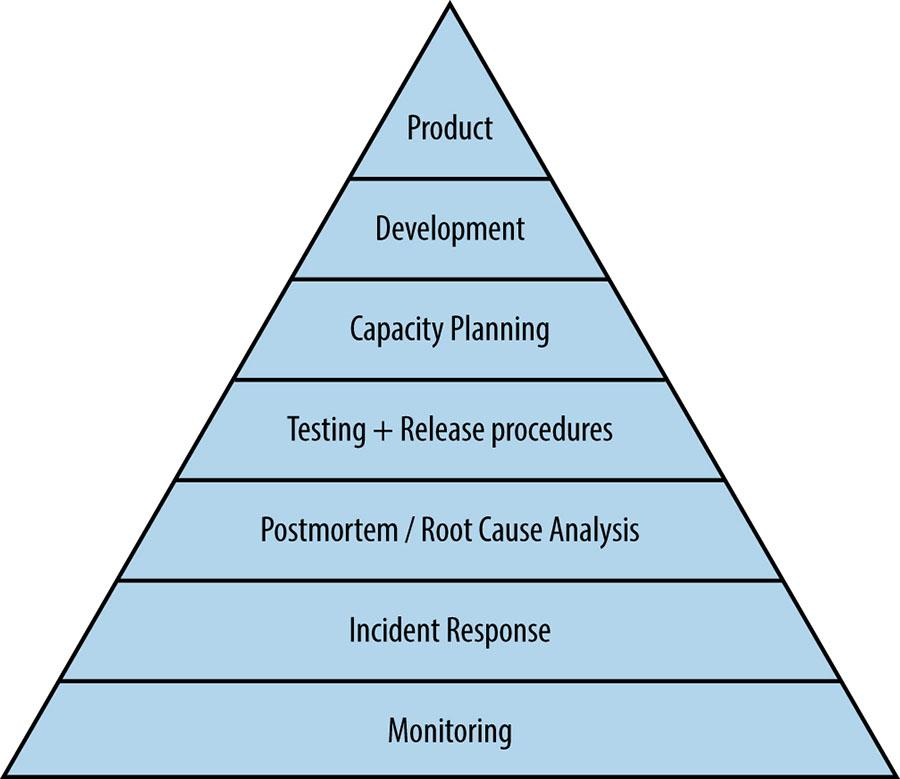

# Service Level Objectives

# Emmett, ProdEng

# Google SRE

# Structural Conflict

Innovation and stability are effectively opposites

Successful companies balance these interests over the long term

# “Dev” vs “Ops”

__DEV__

Developers of new functionality

Innovation

__OPS__

Maintainers of existing systems

Stability

At Parsely\, these roles are fluid\. Product Engineers alternate between “dev” and “ops” functions as needed\.

# Aligning Incentives

Give both groups the same goal

This goal is a number called an “error budget”

# Building Blocks

Service level indicators

Service level objectives

Service level agreements

Error budgets

# Service Level Indicators

"a carefully defined quantitative measure of some aspect of the level of service"

Latency\, throughput\, availability

The number of API calls that complete in at most 100ms

# Service Level Objectives

"a target value or range of values for a service level that is measured by an SLI"

99\.9% of API calls will complete in at most 100ms

# Error Budgets

Rate at which an SLO can be missed

“Our SLO says that 99\.9% of API calls will complete in at most 100ms\. \.09% of calls have exceeded 100ms so far this quarter\.”

Remaining error budget: \.01%

# Service Level Agreements

Written into contracts with customers

Distinct from SLOs

Should be less ambitious than corresponding SLOs

# Datadog SLOs

# 

# Questions SLOs Can Help Answer

How much error handling should I write in this module?

How thoroughly should I cover this code with tests?

What is the priority of this user\-affecting bug?

What’s worth sending a pager alert about?

What is the maximum response time for this pager?

# Evaluating Error Budgets Per Iteration/Quarter

Inform the roadmap

Freeze deployments when budget is low

Induce planned downtime when budget is high

# Google’s Hierarchy of Reliability

# Picking Useful Metrics

SLIs: related directly to user experience

SLOs: related directly to user expectations and product goals

Use percentiles instead of averages

# Defining Useful SLOs

Don’t arbitrarily choose “four nines”

Minimum acceptable service level

Regularly reevaluate with product and engineering

# Tracking SLOs at Parsely: Notes

Missing some metrics

Does not take data integrity into account

Requires broad organizational buy\-in to be useful

# Further Reading

SRE chapter 4: Service Level Objectives _[https://landing\.google\.com/sre/sre\-book/chapters/service\-level\-objectives/](https://landing.google.com/sre/sre-book/chapters/service-level-objectives/)_

Site Reliability Workbook chapter 2: Implementing SLOs

_[https://landing\.google\.com/sre/workbook/chapters/implementing\-slos/](https://landing.google.com/sre/workbook/chapters/implementing-slos/)_

Parsely’s SLO dashboard \(WIP\)

_[https://app\.datadoghq\.com/dashboard/mn9\-gf4\-fdp/service\-level\-indicators](https://app.datadoghq.com/dashboard/mn9-gf4-fdp/service-level-indicators)_

